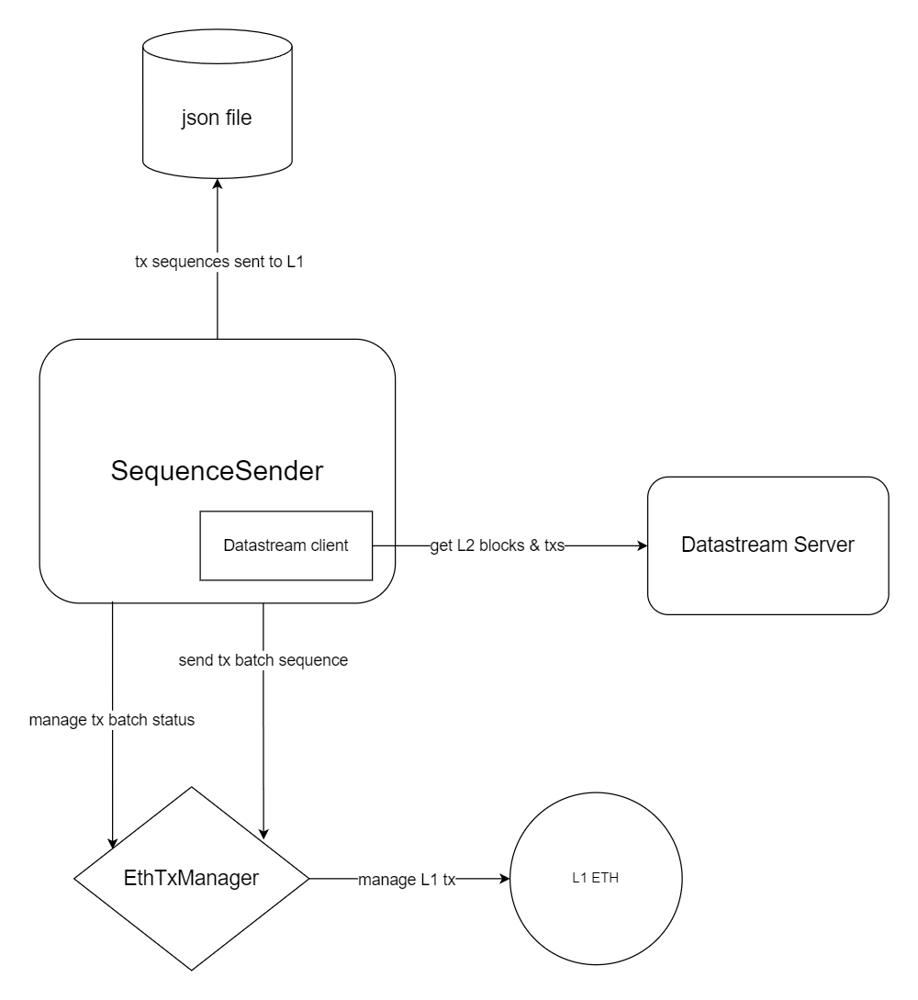

# zkevm-sequence-sender
Stateless autonomous binary to sequence L2 batches and send them to L1.

## Architecture


- **Sequence Sender**: Gets batches from the datastream, detects when they have been closed, and aggregates as many of them as possible. Then decides the time to send those batches to L1 to get its state to transition to virtualized.

- **JSON file**: Persistence of transactions sent to L1. It is used as a cache for transaction management.

- **Datastream client**: Sequence Sender uses the stream client implemented in the [data streamer](https://github.com/0xPolygonHermez/zkevm-data-streamer) library to connect to a datastream server.

- **Datastream server**: The data source is a datastream server, so the SequenceSender connects to the stream server to get information about L2 transactions, blocks, and batches.

- **EthTxManager**: [Library](https://github.com/0xPolygonHermez/zkevm-ethtx-manager) used for sending and monitoring L1 transactions.

## Config
To the existing configuration in the SequenceSender from the [Node](https://github.com/0xPolygonHermez/zkevm-node), the following configuration parameters have been added.

Wait time for a finalized transaction to be purged from the persistence file:
```
[SequenceSender]
WaitPeriodPurgeTxFile=48h
```

Maximum number of transactions pending completion. Once this number is reached, no new transactions will be sent until one completes:
```
[SequenceSender]
MaxPendingTx=1
```
